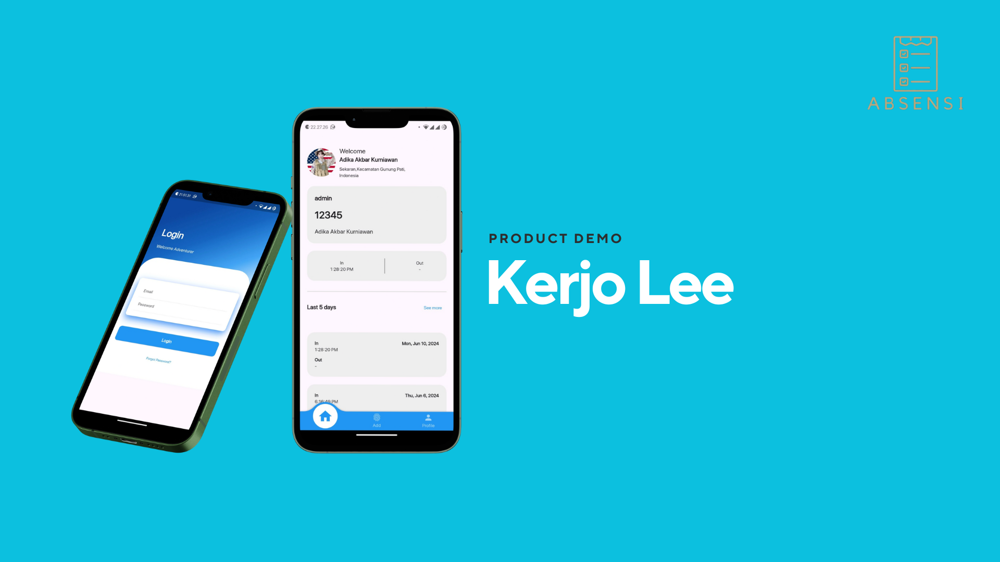

# Kerjo Lee

Kerjo Lee is an employee attendance app built with Flutter and powered by Firebase. It simplifies attendance management with real-time tracking and reporting, providing an efficient solution for businesses to manage employee check-ins and check-outs effortlessly

## Demo

## Features

- **Simplify Attendance:** By simply pressing the attendance button, your attendance is recorded.

- **Secure Authentication:** Firebase authentication ensures the security of your data, with Google Sign-In for easy access.

## Installation

1. Clone this repository using `git clone https://github.com/Dikaayyy/Kerjo-Lee-App.git
2. Navigate to the project directory: `cd Kerjo-Lee-App`
3. Install dependencies: `flutter pub get`
4. **Add `google-services.json`:** For Firebase setup, each developer needs to add their own `google-services.json` file obtained from their Firebase project. Place this file in the `android/app` directory.

6. **Set Up Firebase Authentication:**
   - Go to the Firebase Console and create a project.
   - Enable the Email/Password sign-in method.
   - Add your Android app to the project and download the `google-services.json` file.

7. **Set Up Firebase Realtime Database:**
   - In the Firebase Console, create a Realtime Database.
   - Set up security rules as per your requirements.
   - Update the Firebase configuration in your Flutter app code.

8. Run the app: `flutter run`

## Required Tools

- Android Studio
- Visual Studio Code (Optional)
- Flutter
- Dart
- Android Emulator or Android Real Device

## Manual Book
[Manual Book Kerjo Lee](Manual Book Kerjo Lee.pdf)

## Contributions

Contributions are welcome! If you find a bug or want to add new features, feel free to open an issue or submit a pull request.

-----

### Designed and developed with ❤️ by [Adika Akbar Kurniawan](https://www.linkedin.com/in/adika-akbar-kurniawan/) and Team.
